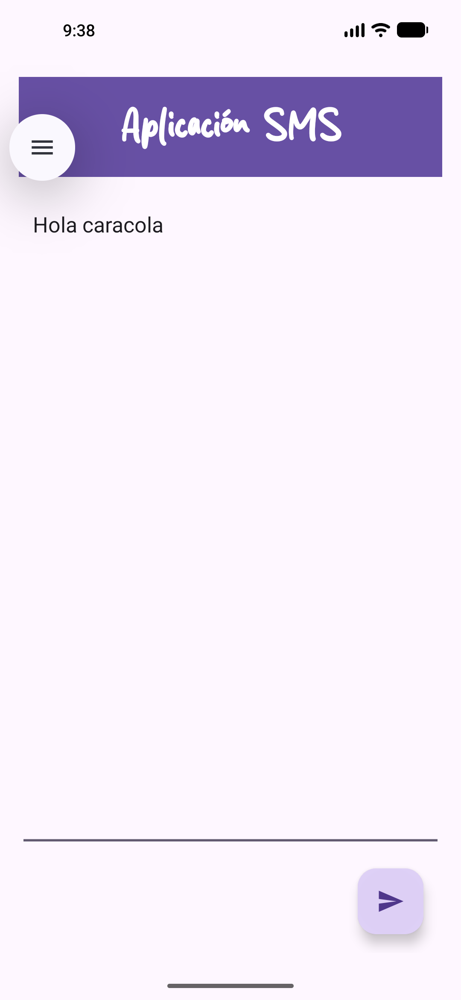
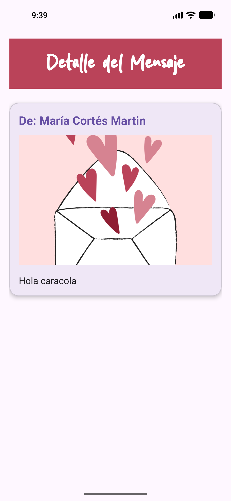

# SendMessage - Android App de Envío de Mensajes con Intents

Aplicación Android en **Kotlin** que demuestra cómo pasar objetos complejos entre dos
actividades usando un `Intent` explícito y un `Bundle`, con el ciclo de vida de `Activity`
como eje del aprendizaje.
   



## Características y Funcionalidades

- Captura de texto mediante un `EditText` y envío con un `FloatingActionButton`.
- Transferencia de un objeto `Message` (serializable) entre actividades mediante
  `Bundle.putSerializable` y `Bundle.getSerializable`.
- Modelo de datos compuesto por `Message` y `Person`, ambos implementan `Serializable`.
- Seguimiento completo del ciclo de vida de `Activity` con trazas en LogCat.
- Formateo del nombre del remitente con recursos de cadena y placeholders (`%1$s %2$s`).
- Documentación API generada con **Dokka 2.0** en formato HTML.


## Arquitectura y Stack Tecnológico

| Capa | Tecnología |
|---|---|
| Lenguaje | Kotlin 2.2.10 (soporte integrado en Android Gradle Plugin 9.3, sin plugin `kotlin-android` declarado) |
| UI | Vistas XML con `findViewById` + Material Components (MDC) |
| Layouts | `LinearLayout` (uno anidado en un `ScrollView`) |
| Arquitectura | Dos actividades (Activity-to-Activity) con paso de datos por `Intent` |
| Tema | `Theme.MaterialComponents.DayNight.DarkActionBar` |
| Build | Android Gradle Plugin 9.3.0, Gradle 9.8.0 |
| Documentación | Dokka 2.0.0 (plugin Gradle v2) |

### Componentes

| Clase | Responsabilidad |
|---|---|
| `SendMessageActivity` | Activity principal (`LAUNCHER`). Captura el mensaje, construye el modelo y lanza la lectura. |
| `ViewMessageActivity` | Activity secundaria. Recupera el `Bundle`, deserializa el `Message` y lo muestra. |
| `Message` | `data class` serializable: `id`, `content`, `sender`, `receiver`. |
| `Person` | `data class` serializable: `dni`, `name`, `surname`. |
| `SendMessageApplication` | Clase `Application` global declarada en el manifiesto. |

### Dependencias principales

**En uso** (imports reales en `app/src/main/java/`):

| Dependencia | Uso |
|---|---|
| `androidx.appcompat` | `AppCompatActivity` como clase base de ambas actividades |
| `com.google.android.material` | `FloatingActionButton` en `activity_send_message.xml` |

**Declaradas pero no utilizadas** (heredadas del `template` inicial):

| Dependencia | Estado |
|---|---|
| `androidx.constraintlayout` | Ningún layout lo usa; ambos son `LinearLayout` |
| `androidx.navigation-fragment-ktx` / `-ui-ktx` | Sin `NavHost`, grafo ni import; la navegación usa `startActivity` |
| `androidx.core-ktx` | Sin import |
| `androidx.activity-ktx` | Sin import |

## API, Endpoints y Módulos

Esta aplicación es **local y sin capa de red**: no consume ni expone APIs. No hay
`Retrofit`, `OkHttp`, `Volley` ni ninguna otra cliente HTTP, y la única interfaz entre
componentes es el paso de datos interno descrito en [Flujo de Datos](#flujo-de-datos).

El manifiesto declara `android.permission.INTERNET`, heredado también del `template`,
pero ningún código lo utiliza.

Los módulos de código son los cinco listados en [Componentes](#componentes).

## 🛠️ Comenzando (Getting Started)

- **JDK 21** (declarado en `gradle/gradle-daemon-jvm.properties` como `toolchainVersion=21`).
- Android SDK Platform 37 (`compileSdk 37`, `targetSdk 37`, `minSdk 24`).
- Android SDK configurado en `local.properties` mediante `sdk.dir`.

> El proyecto fija `sourceCompatibility`/`targetCompatibility` en Java 11, pero el JDK que
> ejecuta el build es 21.

## Instalación y Ejecución

1. Clona el repositorio:
   ```bash
   git clone https://github.com/moronlu18/SendMessageKotlin.git
   cd SendMessageKotlin
   ```

2. Verifica que `local.properties` contiene tu SDK:
   ```properties
   sdk.dir=/ruta/a/tu/Android/Sdk
   ```

3. Compila y ejecuta:
   ```bash
   ./gradlew :app:assembleDebug
   ./gradlew :app:installDebug
   ```

   > `gradlew` está versionado sin permiso de ejecución (`100644`). Si `./gradlew` te da
   > `Permission denied`, usa `sh gradlew ...` o ejecuta `chmod +x gradlew`.

4. Lanza la app desde Android Studio o con:
   ```bash
   adb shell am start -n com.example.sendmessage/.SendMessageActivity
   ```

### Generar la documentación API

La documentación KDoc se compila a HTML en el directorio `documentation/`:

```bash
./gradlew :app:dokkaGenerate
```

Resultado: `documentation/index.html`. Para regenerar desde cero, usa `--rerun-tasks`.

> **Nota sobre Dokka 2.0.** En la versión 2.0.0 el plugin Gradle v2 sigue siendo
> experimental, por lo que `gradle.properties` necesita
> `org.jetbrains.dokka.experimental.gradle.pluginMode=V2EnabledWithHelpers`.
> A partir de Dokka **2.1.0** esa línea puede eliminarse porque v2 pasa a ser el modo único.

## Flujo de Datos

```text
SendMessageActivity                  ViewMessageActivity
─────────────────────                ────────────────────
EditText  ──► sendMessage()
                │
                ├─ Person("...", "María", "Cortés")
                ├─ Person("...", "Lourdes", "Rodríguez")
                ├─ Message(1, texto, sender, receiver)
                │
                ├─ Bundle.putSerializable("KEY_MESSAGE", message)
                ├─ Intent.putExtras(bundle)
                └─ startActivity ──────────────► getSerializable("KEY_MESSAGE")
                                                        │
                                                        ├─ tvSender  ← getString(plantilla)
                                                        └─ tvMessage ← message.content
```

## Licencia y Contacto

Distribuida bajo la **Apache License 2.0**. El texto completo está en [`LICENSE`](LICENSE).

```
Copyright 2026 Lourdes Rodríguez
```

- **Autora:** Lourdes Rodríguez (`@author` en el KDoc de las clases)
- **Repositorio:** <https://github.com/moronlu18/SendMessageKotlin>

Apache 2.0 permite uso comercial, modificación y distribución, y exige conservar el
aviso de copyright. Aporta además una concesión de patentes explícita y, si el proyecto
incluira un fichero `NOTICE`, este debería conservarse en las obras derivadas.
